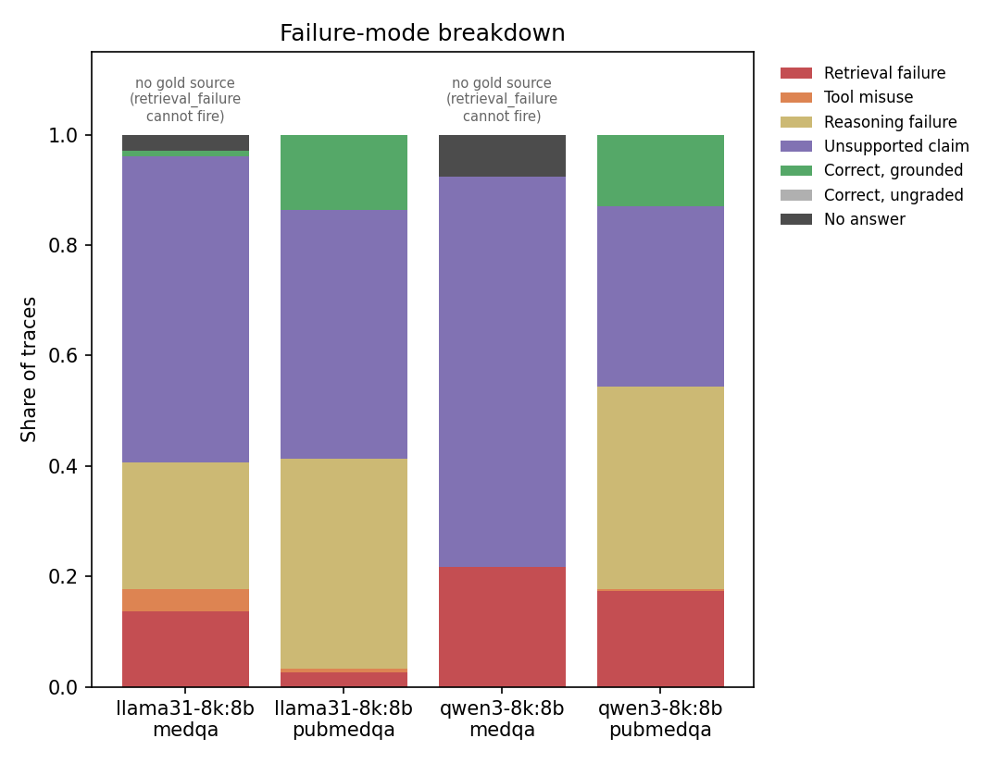

# Clinical Reasoning Agent + Evidence-Grounding Benchmark

A tool-using clinical QA agent, and an evaluation framework that measures why it fails
rather than only how often. The framework is the point; the agent exists to produce
traces for it.

The question it answers is not "how often is the agent right" but "when it is right, is
it right for the reasons it gives".

## What we found

Across two open-weight 8B models on the PubMedQA test split, between 74% and 90% of
*correct* answers contain at least one claim not entailed by the evidence the agent
retrieved to justify it. At the claim level only 20–24% of extracted claims are entailed
by any retrieved passage.

The range is an honest uncertainty rather than a hedge. 74.4% is the figure at the
default entailment cut of 0.5. Calibrating that cut on one annotation pass and reporting
it on a disjoint one gives 90.1%, and improves agreement with human labels (kappa 0.737
to 0.771). We do not adopt the calibrated cut, because only one of 24
threshold-sensitive held-out traces changes label between the two while the headline
moves sixteen points. The direction survives every threshold in the grid; the magnitude
is not identified by 80 annotations. Details in `results/tables/calibration.md`.

Accuracy cannot see any of this. An agent that answers correctly and invents its
justification scores as a clean win on every standard benchmark.



### Retrieval is not decorative

The obvious objection is that the agent might ignore what it retrieves, in which case
of course its justifications are not grounded in it. A closed-book ablation rules this
out. Removing tools entirely, paired on the same questions:

| | accuracy on PubMedQA | McNemar p | claims entailed |
|---|---|---|---|
| qwen3, tools → closed-book | 49.5% → 31.7% | 2.9e-07 | 22.0% → 11.4% |
| llama3.1, tools → closed-book | 63.3% → 47.3% | 4.5e-09 | 24.0% → 13.6% |

Retrieval is worth sixteen to eighteen accuracy points and roughly doubles the share of
entailed claims, replicated independently on both models. So the evidence is
demonstrably used. The finding is not that retrieval fails but that it succeeds and the
stated reasoning is still not a faithful account of it.

On MedQA the same ablation shows nothing significant (+4.0pp and −1.5pp), which is what
a corpus that does not cover USMLE vignettes should produce. That dataset ends up
serving as a negative control for retrieval quality.

Closed-book claims are scored against the passages the tool-using run retrieved for the
same question. Scoring them against their own empty evidence would return 100%
unsupported by construction and measure the ablation rather than the agent.

## Test-split results

300 questions per dataset per model, official test splits, run once.

| Model | Dataset | Accuracy (95% CI) | Hit@k | Tool P/R |
|---|---|---|---|---|
| qwen3:8b | MedQA | 76.5% [71.5, 81.2] | n/a | n/a (n=21, no tools used) |
| qwen3:8b | PubMedQA | 45.7% [40.3, 51.3] | 79.3% | 100.0% / 81.0% (n=300) |
| llama3.1:8b | MedQA | 58.1% [52.2, 63.6] | n/a | 95.0% / 90.5% (n=21) |
| llama3.1:8b | PubMedQA | 58.7% [53.0, 64.0] | 95.3% | 98.3% / 97.7% (n=300) |

The ranking crosses over by dataset, with non-overlapping intervals in both directions.
Either model on its own supports the opposite conclusion about which is better. This is
the clearest argument that running two models was substantive rather than procedural.

Failure modes, as a percentage of 300:

| Model | Dataset | no answer | retrieval | tool misuse | reasoning | unsupported | grounded |
|---|---|---|---|---|---|---|---|
| qwen3:8b | MedQA | 8% | 22% | 0% | 2% | 71% | 0% |
| qwen3:8b | PubMedQA | 0% | 17% | 0% | 37% | 33% | 13% |
| llama3.1:8b | MedQA | 3% | 14% | 4% | 23% | 55% | 1% |
| llama3.1:8b | PubMedQA | 0% | 3% | 1% | 38% | 45% | 14% |

The two models fail differently at comparable accuracy. qwen3 on MedQA fails almost
entirely by not retrieving (22% retrieval failure against 2% reasoning failure); it
searched on 8% of MedQA questions. llama3.1 retrieves and misreads what it gets. An
intervention that helps one would do little for the other.

## Validation

The classifier is validated against blind human annotation in two disjoint passes of
forty traces each. A development pass found three defects in the classifier and drove
two taxonomy corrections. A held-out pass, drawn from traces the annotator had not seen
and balanced across both models, was then scored: **Cohen's kappa 0.737, 82.5%
agreement**. Held-out kappa exceeds the in-sample figure of 0.673, so the corrections
generalise rather than fitting the labels that prompted them.

Per-label agreement is strongest where the contribution lies — 19 of 20 on
`unsupported_claim`, 8 of 9 on `reasoning_failure` — and weakest on `retrieval_failure`
at 3 of 6, where the classifier detects a missed gold PMID or an empty retrieval but
cannot see evidence a reader judges retrieved-but-unhelpful.

An LLM-as-judge pass on a stratified sample gives 75.0% and 77.5% trace-level
hallucination against the NLI checker's 82–86%. Two instruments from different model
families landing within a few points is weak but real corroboration.

## Other results

**Tool budget is not a useful lever here.** At a budget of five the agent averages 2.19
calls; halving it to two gives 1.77 and doubling it to ten gives 2.30, with only 23 of
555 episodes exceeding five calls when allowed ten. The agent stops of its own accord
well before any ceiling. The caveat is that the effect is small because this agent
under-uses its budget, not because budget cannot matter in principle. A fifty-call arm
was attempted and refused by the preflight: its worst-case prompt is roughly 40k tokens
against a 12,288 window, which 8 GB of VRAM cannot serve.

**The adversarial trap set does not trap.** Thirty hand-written items pair a clinical
vignette with a planted distractor. Both models resisted almost completely — qwen3 30 of
30, llama3.1 28 of 30, against 25% chance. The items are badly designed: each pairs a
recklessly wrong distractor with a cautious, hedged gold answer, so a model with ordinary
medical priors picks the cautious option without needing evidence. They test a preference
for careful phrasing, not resistance to unsupported claims.

The grounding measurement on those same traces is still the sharpest version of the main
result. qwen3 answered all thirty correctly while searching on three of them, and 96% of
its traces carry at least one unsupported claim (21% of claims entailed). Getting the
right answer and justifying it from evidence are separable, and these items separate
them completely.

## Setup

Python 3.11 exactly — several pinned dependencies have no wheels for newer versions —
plus [uv](https://docs.astral.sh/uv/), which can fetch 3.11 for you.

```powershell
git clone https://github.com/Ritwick14999/Project_new.git
cd Project_new
python tasks.py setup --extras dev,dense
python tasks.py doctor
python tasks.py test
```

`tasks.py` works identically on Windows, macOS and Linux; the `Makefile` has the same
targets for POSIX shells. `doctor` checks the Python version, the virtualenv, and
whether Ollama is serving the models a rollout needs.

## Reproducing

Traces are committed and evaluation is a pure function of them, so every number and
figure regenerates with no GPU, no model and no network:

```powershell
python -m cra.cli eval --experiments final_qwen3 final_llama31 --nli
```

Re-running the agent itself needs Ollama. One detail matters and is easy to get wrong:
Ollama serves a 4,096-token context by default and truncates longer prompts silently,
dropping the oldest tokens, which are the system prompt and the question. The longest
episode in the final run reached 7,755 tokens. The window has to be raised server-side —
the OpenAI-compatible endpoint ignores `options.num_ctx` — so the runs use a Modelfile
variant:

```powershell
ollama pull qwen3:8b
ollama create qwen3-8k:8b -f Modelfile     # FROM qwen3:8b + PARAMETER num_ctx 12288
python tasks.py data
python tasks.py index
python tasks.py rollout -- --config final_qwen3 --dry-run
```

The preflight sends a prompt of the expected size and checks the server evaluated all of
it, then refuses to start a run whose prompts would be truncated. A configuration read is
not evidence here: the value can be unset, overridden per-model, or changed on the server.

## How the evaluation works

Two stages separated by a self-contained trace file.

```
ROLLOUT  (needs Ollama, stochastic, slow)  ->  results/traces/<exp>/*.jsonl.gz
EVAL     (pure function of traces)         ->  tables + figures
```

A trace inlines the full text of every retrieved passage and tool output, so it stays
interpretable after the retrieval index is rebuilt and the instrument can be improved and
re-run over existing traces at no rollout cost. That property was used repeatedly: eight
defects found during development and annotation were each corrected and every affected
number re-scored without re-running a single model.

Each trace receives exactly one primary label by ordered rules — retrieval failure, then
tool misuse, then reasoning failure, then unsupported claim (a correct answer with an
ungrounded justification), then correct and grounded. A missing answer is kept distinct
from a wrong one. Hallucination is also an independent boolean on every trace, and the
hallucination rate comes from those flags rather than from the primary label; deriving it
from the label would make hallucinations inside wrong answers invisible.

## Demo

```powershell
python tasks.py setup --extras dev,demo
python tasks.py demo-app
```

Enter a clinical question and watch the agent's tool calls, the evidence it retrieves,
and the per-claim grounding check. It runs on a deterministic mock model by default, so
it needs no credentials; point it at Ollama to drive a real one.

## Limitations

Two 8B open-weight models is a weaker generalisation claim than open-weight against
frontier. It shows a failure profile is not one model's quirk, but says nothing about how
that profile changes with capability.

The MedQA grounding figures of 98–100% measure corpus coverage, not fabrication. The
retrieval corpus is built from PubMedQA abstracts and does not cover USMLE vignettes, and
qwen3 answers most MedQA questions without searching at all. PubMedQA is where the
grounding measure means what it says.

The `expected_tools` oracle is a keyword rule whose own error rate is uncharacterised, so
tool precision and recall are reported against the oracle rather than against ground
truth. It fires on only 21 of 300 MedQA questions, so its blast radius is small, but it is
not ground truth.

The entailment threshold's magnitude is unidentified, as described above. Pinning it would
need roughly 150–200 labelled traces concentrated on correct answers rather than 80 spread
across all outcomes.

The second annotation pass was not blind to feedback from the first, and used a single
annotator who is not a clinician, so inter-annotator agreement is unmeasured.

The trap set does not discriminate, for the reasons given above. A useful version needs
distractors that are plausible and cautiously phrased, differing from the gold answer in a
factual claim the corpus can settle.

## Layout

```
src/cra/
  types.py          Trace / Question / Evidence / ToolCallRecord — the contract
  llm/              provider-agnostic client; Ollama, Anthropic, mocks, response cache
  agent/            control loop, prompts, final-answer parsing
  tools/            retrieval, drug interactions, four clinical calculators, unit conversion
  retrieval/        BM25 (default) and dense indexes over the PubMedQA corpus
  data/             dataset download, splits, trap set, expected-tools oracle
  eval/             claims, entailment, failure modes, calibration, ablations, annotation
configs/            composable YAML: model / agent / retrieval / experiments
results/METRICS.md  every reported number with the caveat that constrains it
results/traces/     committed traces — the reproducibility anchor
docs/DESIGN.md      design rationale
writeup/paper.md    the write-up
```

301 tests, no network or credentials required: `python tasks.py test`.

## Data

No patient data. PubMedQA and MedQA are public benchmarks fetched by `python tasks.py
data` from `pubmedqa/pubmedqa` and the MIRAGE benchmark, recorded with URL and SHA-256 in
`data/manifests/` and not redistributed here.

The drug-interaction table is a curated teaching table assembled for benchmarking. It is
deliberately incomplete and is not clinical decision support.
